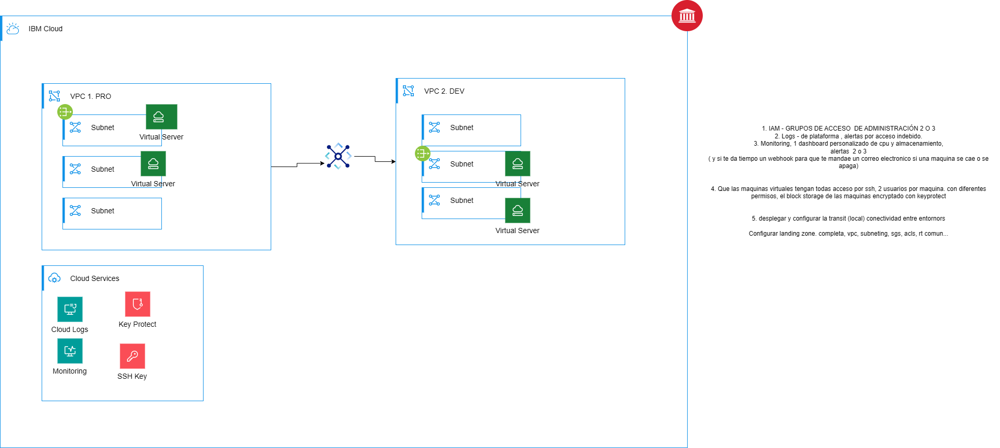

# GCP-Architecture

Documentación de la arquitectura de Landing Zone en Google Cloud Platform, diseñada para soportar entornos de Producción y Desarrollo con altos estándares de seguridad, aislamiento de red y cifrado de datos.

## Esquema infraestructura

A continuación se muestra el esquema de la infraestructura que se va a implementar:



***

## Rango de IPs

Esta tabla define la **segmentación de red** para aislar los entornos de Producción y Desarrollo. Cada VPC tiene su propio rango CIDR para evitar conflictos de IPs, y las subredes están dimensionadas para permitir hasta 256 IPs por segmento. Las subredes vacías están reservadas para futuro crecimiento sin necesidad de reconfigurar la arquitectura.

| VPC        | CIDR VPC    | Subred   | CIDR Subred | IPs disponibles | Uso                            | VMs en la subred   |
| ---------- | ----------- | -------- | ----------- | --------------- | ------------------------------ | ------------------ |
| VPC 1. PRO | 10.0.0.0/16 | Subnet-1 | 10.0.1.0/24 | 256 IPs         | VM de Producción 1 (privada)   | VM sin IP pública  |
|            |             | Subnet-2 | 10.0.2.0/24 | 256 IPs         | VM de Producción 2 (privada)   | VM sin IP pública  |
|            |             | Subnet-3 | 10.0.3.0/24 | 256 IPs         | Reservada (futuro crecimiento) | Vacía              |
| VPC 2. DEV | 10.1.0.0/16 | Subnet-1 | 10.1.1.0/24 | 256 IPs         | VM de Desarrollo 1 (privada)   | VM sin IP pública  |
|            |             | Subnet-2 | 10.1.2.0/24 | 256 IPs         | VM de Desarrollo 2 (privada)   | VM sin IP pública  |
|            |             | Subnet-3 | 10.1.3.0/24 | 256 IPs         | Reservada (futuro crecimiento) | Vacía              |

***

## Configuración Cloud NAT

Cloud NAT permite que las **VMs privadas (sin IP pública) puedan acceder a Internet** para descargar actualizaciones, paquetes y comunicarse con servicios externos, mientras permanecen completamente inaccesibles desde Internet. Cada VPC tiene su propio Cloud NAT independiente para mantener el aislamiento de red entre entornos.

| VPC        | Cloud NAT     | Cloud Router | Región      | Subredes afectadas           |
| ---------- | ------------- | ------------ | ----------- | ---------------------------- |
| VPC 1. PRO | cloud-nat-pro | router-pro   | us-central1 | Subnet-1, Subnet-2, Subnet-3 |
| VPC 2. DEV | cloud-nat-dev | router-dev   | us-central1 | Subnet-1, Subnet-2, Subnet-3 |

***

## VPC Firewall Rules

Las reglas de firewall controlan el **tráfico de red** entre VMs y desde el exterior. Las reglas `allow-iap-ssh-*` permiten conexiones SSH seguras vía Identity-Aware Proxy sin exponer las VMs a Internet público. Las reglas internas permiten comunicación completa dentro de cada VPC, y las reglas de peering habilitan conectividad controlada entre entornos PRO y DEV.

| VPC        | Regla                 | Origen                | Destino                | Puerto            | Acción | Descripción             |
| ---------- | --------------------- | --------------------- | ---------------------- | ----------------- | ------ | ----------------------- |
| VPC 1. PRO | allow-iap-ssh-pro     | 35.235.240.0/20 (IAP) | VMs con tag: allow-iap | 22                | ALLOW  | Acceso SSH vía IAP      |
| VPC 1. PRO | allow-icmp-pro        | 10.0.0.0/16           | Todas                  | ICMP              | ALLOW  | Ping interno VPC PRO    |
| VPC 1. PRO | allow-internal-pro    | 10.0.0.0/16           | Todas                  | Todos             | ALLOW  | Tráfico interno VPC PRO |
| VPC 1. PRO | allow-from-dev-to-pro | 10.1.0.0/16 (VPC DEV) | Todas                  | 22, 80, 443, ICMP | ALLOW  | Tráfico desde VPC DEV   |
| VPC 2. DEV | allow-iap-ssh-dev     | 35.235.240.0/20 (IAP) | VMs con tag: allow-iap | 22                | ALLOW  | Acceso SSH vía IAP      |
| VPC 2. DEV | allow-icmp-dev        | 10.1.0.0/16           | Todas                  | ICMP              | ALLOW  | Ping interno VPC DEV    |
| VPC 2. DEV | allow-internal-dev    | 10.1.0.0/16           | Todas                  | Todos             | ALLOW  | Tráfico interno VPC DEV |
| VPC 2. DEV | allow-from-pro-to-dev | 10.0.0.0/16 (VPC PRO) | Todas                  | 22, 80, 443, ICMP | ALLOW  | Tráfico desde VPC PRO   |

***

## Configuración Cloud KMS (Cifrado de Discos)

Cloud KMS proporciona **cifrado gestionado por el cliente (CMEK)** para los discos de todas las VMs. La rotación automática de claves cada 90 días garantiza que, en caso de compromiso de una clave, solo los últimos 90 días de datos podrían verse afectados. El Key Ring actúa como contenedor lógico de las claves de cifrado.

| Recurso    | Nombre                 | Región      | Rotación automática | Usado por                                  | Coste estimado |
| ---------- | ---------------------- | ----------- | ------------------- | ------------------------------------------ | -------------- |
| Key Ring   | vm-encryption-keyring  | us-central1 | -                   | Contenedor de claves de cifrado            | $0             |
| Crypto Key | vm-disk-encryption-key | us-central1 | ✅ Cada 90 días      | Cifrar discos de todas las VMs (PRO y DEV) | ~$0.06/mes     |

***

## Configuración IAM (Permisos de Usuarios y Service Accounts)

Los permisos IAM definen **quién puede hacer qué** en el proyecto. El usuario administrador tiene control completo sobre las VMs y KMS. La Service Account `github-actions-sa` permite automatización CI/CD sin privilegios de sudo. El Compute Engine Service Account tiene acceso limitado solo a las claves KMS necesarias para cifrar/descifrar discos.

| Usuario/Service Account        | Rol IAM                                    | Descripción                                                |
| ------------------------------ | ------------------------------------------ | ---------------------------------------------------------- |
| jcorrochano@stemdo.io          | roles/compute.osAdminLogin                 | Permite usar OS Login CON sudo en VMs                      |
| jcorrochano@stemdo.io          | roles/iap.tunnelResourceAccessor           | Permite usar túneles IAP para conectarse                   |
| jcorrochano@stemdo.io          | roles/compute.viewer                       | Permite ver recursos de Compute Engine                     |
| jcorrochano@stemdo.io          | roles/compute.instanceAdmin.v1             | Permite gestionar VMs (crear, modificar, borrar)           |
| jcorrochano@stemdo.io          | roles/cloudkms.admin                       | Administrador de claves KMS (crear, rotar, revocar)        |
| jcorrochano@stemdo.io          | roles/cloudkms.cryptoKeyEncrypterDecrypter | Puede cifrar/descifrar con las claves KMS                  |
| github-actions-sa              | roles/compute.osLogin                      | Permite usar OS Login SIN sudo en VMs                      |
| github-actions-sa              | roles/iam.serviceAccountUser               | Permite actuar como Service Account                        |
| github-actions-sa              | roles/iap.tunnelResourceAccessor           | Permite usar túneles IAP                                   |
| Compute Engine Service Account | roles/cloudkms.cryptoKeyEncrypterDecrypter | Permite a VMs usar las claves para cifrar/descifrar discos |

***

## Configuración VPC Peering (Conectividad entre entornos)

VPC Peering establece **conectividad privada bidireccional** entre las VPCs de Producción y Desarrollo sin necesidad de IPs públicas o VPNs. Esto permite que las VMs de ambos entornos se comuniquen directamente usando IPs privadas, útil para acceso a bases de datos compartidas, servicios internos o pruebas de integración.

| Peering            | VPC Origen               | VPC Destino              |
| ------------------ | ------------------------ | ------------------------ |
| peering-pro-to-dev | VPC 1. PRO (10.0.0.0/16) | VPC 2. DEV (10.1.0.0/16) |
| peering-dev-to-pro | VPC 2. DEV (10.1.0.0/16) | VPC 1. PRO (10.0.0.0/16) |
 
***

## Identity-Aware Proxy (IAP) - Acceso SSH sin VPN

### ¿Qué es IAP?

Identity-Aware Proxy (IAP) es un servicio de Google Cloud que implementa un **modelo de seguridad Zero Trust**, permitiendo acceso SSH y RDP a VMs sin necesidad de IPs públicas, bastions hosts o VPNs.

### Beneficios en este proyecto

En esta arquitectura, IAP es fundamental porque:

- **Elimina IPs públicas**: Las VMs no tienen IPs externas, reduciendo la superficie de ataque
- **Sin bastion host**: No se necesita mantener una VM dedicada como punto de entrada
- **Sin VPN**: Los usuarios acceden directamente sin configurar túneles VPN complejos
- **Autenticación por identidad**: Usa credenciales de Google (jcorrochano@stemdo.io) en lugar de claves SSH tradicionales
- **Control granular**: Los permisos IAM determinan quién puede conectarse a qué VMs

### Cómo funciona

1. El comando `gcloud compute ssh` crea un túnel HTTPS cifrado desde tu PC hasta la VM
2. IAP intercepta la conexión y verifica tu identidad (OAuth)
3. Comprueba que tienes el rol `iap.tunnelResourceAccessor`
4. Verifica que la VM tiene la regla de firewall `allow-iap-ssh-*` (rango 35.235.240.0/20)
5. Establece la conexión SSH a través del túnel seguro

### Uso en comandos

El flag `--tunnel-through-iap` activa esta funcionalidad:

```bash
gcloud compute ssh vm-pro-2 --tunnel-through-iap
```

***

## Comandos de despliegue

### 1. Autenticación para aplicaciones (Terraform)

Configura credenciales para que Terraform pueda crear recursos en GCP usando Application Default Credentials (ADC).

```bash
gcloud auth application-default login
```

***

### 2. Verificar cuentas autenticadas

Lista las cuentas Google autenticadas y muestra cuál está activa (marcada con asterisco).

```bash
gcloud auth list
```

***

### 3. Configurar proyecto GCP

Define el proyecto por defecto donde se crearán todos los recursos. Evita tener que especificar `--project` en cada comando.

```bash
gcloud config set project balmy-mile-452912-p6
```

***

### 4. Configurar zona por defecto

Define la zona de Compute Engine donde se desplegarán las VMs. Simplifica los comandos al no requerir `--zone` constantemente.

```bash
gcloud config set compute/zone us-central1-a
```

***

### 5. Verificar configuración actual

Muestra la configuración activa de `gcloud` (proyecto, zona, región y cuenta).

```bash
gcloud config list
```

***

### 6. Autenticación de usuario (para SSH)

Autentica tu identidad de usuario para poder conectar vía SSH a las VMs usando IAP y OS Login.

```bash
gcloud auth login
```

***

### 7. Desplegar con Terraform

Comandos necesarios para desplegar la infraestructura con terraform

```bash
terraform init
```

```bash
terraform plan
```

```bash
terraform apply
```

***

### 8. Conectar vía SSH con IAP

Establece una conexión SSH segura a la VM usando IAP (sin IP pública). Requiere firewall rule `allow-iap-ssh-*` y permiso `iap.tunnelResourceAccessor`.

```bash
gcloud compute ssh vm-pro-2 --tunnel-through-iap
```

***

### 9. Verificar conectividad a Internet

Prueba que Cloud NAT funciona correctamente permitiendo que la VM privada pueda hacer ping a servidores públicos (Google DNS).

```bash
ping -c 3 8.8.8.8
```

***

### 10. Verificar conectividad interna VPC PRO

Valida que las reglas de firewall `allow-internal-pro` y `allow-icmp-pro` permiten comunicación entre VMs dentro de la misma VPC.

```bash
ping -c 3 10.0.1.2
```

***

### 11. Verificar VPC Peering

Confirma que el VPC Peering entre PRO y DEV funciona, permitiendo que VMs de diferentes VPCs se comuniquen mediante IPs privadas.

```bash
ping -c 3 10.1.1.2
```

***

## 12. Verificar usuarios OS Login y permisos sudo

Después de ejecutar el despliegue con GitHub Actions, se confirma que se han creado correctamente los dos tipos de usuarios (admin con sudo y service account sin sudo) dentro de las VMs.

```bash
gcloud compute ssh vm-dev-1 --tunnel-through-iap
```

Una vez conectado, se ejecuta el siguiente comando para listar los usuarios y verificar permisos sudo:

```bash
echo "Usuarios:"; getent passwd | grep -E "jcorrochano|sa_"; echo ""; echo "Con sudo:"; sudo ls -1 /var google-sudoers.d/
```

**Salida esperada:**

```
Usuarios:
sa_111117803067181122508:*:4191275422:4191275422::/home/sa_111117803067181122508:/bin/bash
jcorrochano_stemdo_io:*:1511099882:1511099882::/home/jcorrochano_stemdo_io:/bin/bash

Con sudo:
jcorrochano_stemdo_io
```

Esta salida confirma que:
- **Usuario administrador** (`jcorrochano_stemdo_io`): Tiene privilegios sudo para administración del sistema
- **Service Account de GitHub Actions** (`sa_*`): Sin privilegios sudo, siguiendo el principio de mínimo privilegio para automatización

***

### 13. Destruir infraestructura

Elimina todos los recursos creados por Terraform. Los Key Rings de KMS no se borran (limitación de Google Cloud por seguridad).

```bash
terraform destroy
```